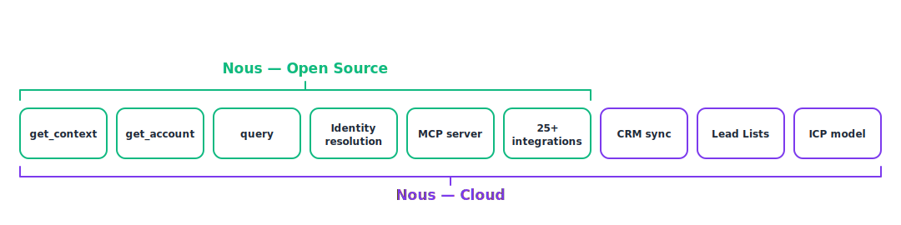

<div align="center">
  
</div>

<div align="center">

[](https://www.gnu.org/licenses/agpl-3.0)
[](https://www.npmjs.com/package/@opennous/mcp)
[](https://discord.gg/2Ph4ZYXw)

</div>

<div align="center">
  <a href="https://docs.opennous.cloud">Docs</a> ·
  <a href="https://docs.opennous.cloud/public-api/introduction">Public API</a> ·
  <a href="https://docs.opennous.cloud/mcp/introduction">MCP Server</a> ·
  <a href="https://discord.gg/2Ph4ZYXw">Discord</a>
</div>

# Nous

**The GTM Context API for agents.** Unify your GTM tools into a single customer graph with every person, conversation and touchpoint in one record, ready for any Agent. Open source, and available as a [hosted service](https://opennous.cloud).

---

## Why Nous?

- **One call, the whole account:** Your agent gets the entire identity-resolved account in a single call, instead of stitching six tools together and guessing over raw dumps.
- **LLM-ready context:** Structured, token-budgeted, agent-shaped. Every fact carries its own source, confidence, and freshness.
- **We handle the hard stuff:** Identity resolution across Apollo, HubSpot, Gmail, and LinkedIn into one canonical record per person.
- **Agent ready:** Connect Nous to any agent or MCP client with a single command.
- **25+ integrations:** Your CRM, outbound, email, and LinkedIn, unified into one graph.
- **Open source:** Self-host the whole primitive under AGPL, or skip the setup with Nous Cloud.

## Core endpoints

| Endpoint | What it returns |
|---|---|
| `get_context(focus, intent)` | the whole account context for a task, token-budgeted and agent-shaped |
| `get_account(id)` | the full record for one person or company, by email or id |
| `query(scope)` | filter activity across people and accounts |

## Quick start

Connect Nous to your agent over MCP — self-host passes its own API URL (on Nous Cloud, drop the `-e` flag):

```bash
claude mcp add nous -e NOUS_API_URL=https://api.yourdomain.com -- npx -y @opennous/mcp
```

Your agent now has `get_context`, `get_account`, and `query`. The examples below show the REST API and its JSON; over MCP your agent gets the same data as a token-budgeted summary.

### `get_context`

The whole account context for a task, token-budgeted and agent-shaped. `focus` takes a domain, email, LinkedIn URL, or id; every fact carries its confidence and freshness:

```bash
curl -X POST https://api.opennous.cloud/v2/context \
  -H "Authorization: Bearer $NOUS_API_KEY" \
  -d '{"focus":"acme.com","intent":"account_review"}'
```

```json
{
  "entity": { "id": "ent_acme", "type": "company" },
  "summary": "Acme Corp, ~500 employees. Sarah Chen promoted to VP RevOps 3mo ago, just deployed Salesforce. 12 SDR roles posted in 7 days. Open deal $45k, no economic buyer.",
  "claims": [
    { "property": "signal.hiring", "value": "12 SDR roles in 7 days", "confidence": 0.95, "freshness": "fresh", "epistemic_class": "observed", "last_observed_at": "2026-06-10" },
    { "property": "signal.stack", "value": "Salesforce deployed 45d ago", "confidence": 0.88, "freshness": "aging", "epistemic_class": "observed", "last_observed_at": "2026-04-30" }
  ],
  "stakeholders": [
    { "entity_id": "ent_sarah", "name": "Sarah Chen", "role": "VP RevOps" }
  ],
  "timeline": [
    { "when": "2026-06-05T14:00:00Z", "type": "call", "tier": "brief", "summary": "competitor name-dropped" }
  ],
  "predictions": [ { "kind": "icp_fit", "value": "high", "confidence": 0.82 } ],
  "icp": { "score": 82 },
  "meta": { "token_estimate": 1200, "claims_returned": 12, "claims_total": 47, "timeline_events": 9 }
}
```

### `get_account`

The full record for one person or company, by email or entity id. `claims` is keyed by property, each with confidence, freshness, and how many times it's been observed.

```bash
curl https://api.opennous.cloud/v2/accounts/sarah@acme.com \
  -H "Authorization: Bearer $NOUS_API_KEY"
```

```json
{
  "entity_id": "ent_sarah",
  "type": "person",
  "claims": {
    "title": { "value": "VP RevOps", "confidence": 0.94, "freshness": "fresh", "epistemic_class": "observed", "observation_count": 3, "last_observed_at": "2026-05-30" }
  },
  "recent_observations": [
    { "kind": "event", "property": "interaction.call", "source": "fireflies", "observed_at": "2026-06-05" }
  ],
  "icp": { "score": 82 }
}
```

### `query`

Filter activity across people and accounts with a structured `scope`. Add a `question` for semantic ranking, and set `return: "entities"` to get one row per account:

```bash
curl -X POST https://api.opennous.cloud/v2/query \
  -H "Authorization: Bearer $NOUS_API_KEY" \
  -d '{"scope":{"property":"interaction.email","since_days":30},"return":"entities","question":"accounts that replied positively then went quiet"}'
```

```json
{
  "return": "entities",
  "matched": 128,
  "returned": 25,
  "items": [
    { "entity_id": "ent_acme", "entity_name": "Acme Corp", "matches": 9,
      "most_recent_at": "2026-05-28", "most_recent_type": "email_replied", "most_recent_source": "gmail" }
  ],
  "rollups": { "by_type": {}, "by_source": {} },
  "meta": { "token_estimate": 900 }
}
```

## Power your agent

Nous is operated by your **agent**, not by clicking through an app. Add it to your stack in one step:

- **Claude Code** — `/plugin marketplace add NousC/nous` then `/plugin install nous@nous-plugins`
- **Codex** — add to `~/.codex/config.toml`:
  ```toml
  [mcp_servers.nous]
  command = "npx"
  args = ["-y", "@opennous/mcp"]
  ```
- **Cursor / any MCP host** — add to `mcp.json`:
  ```json
  { "mcpServers": { "nous": { "command": "npx", "args": ["-y", "@opennous/mcp"] } } }
  ```

Then sign in once — it opens your browser, mints a workspace key, and saves it to `~/.nous/config.json` (the MCP reads it automatically, no key to paste):

```bash
npx @opennous/cli login    # on self-host, add --url https://api.yourdomain.com
```

Now tell your agent **“Set me up — onboard my workspace and build my playbook,”** and it walks setup in order: profile → connect Gmail / LinkedIn / a note-taker → enrichment → import your CRM contacts.

→ [Full MCP docs](https://docs.opennous.cloud/mcp/introduction)

## Open source vs Cloud

Nous is open source under the AGPL-3.0 license. Nous Cloud at [opennous.cloud](https://opennous.cloud) adds the team layer on top of the same graph:

<div align="center">
  
</div>

## Self-host

Run the whole stack — API, worker, MCP server, frontend, Redis, and Caddy (automatic HTTPS) — with Docker Compose on your own infrastructure. You bring a [Supabase](https://supabase.com) project (Postgres + auth) and an Anthropic API key.

**Prerequisites**

- A Linux server with Docker + Docker Compose
- A [Supabase](https://supabase.com) project (free tier is fine)
- An [Anthropic API key](https://console.anthropic.com)
- Three DNS records — `app`, `api`, `mcp` — pointing at your server

```bash
# 1. Clone
git clone https://github.com/NousC/nous.git && cd nous

# 2. Configure
cp nous.env.example nous.env
#    Fill in APP_DOMAIN / API_DOMAIN / MCP_DOMAIN, your Supabase URL + keys,
#    and ANTHROPIC_API_KEY. Generate the encryption key:
openssl rand -hex 32      # paste the output into ENCRYPTION_KEY=
#    SELF_HOSTED=true is already set — it runs the open primitive, unmetered.

# 3. Create the database
#    Open supabase/schema.sql in your Supabase SQL editor and run it once.

# 4. Launch (Caddy provisions TLS automatically once your DNS resolves)
docker compose --env-file nous.env up -d --build
```

Open `https://app.yourdomain.com` and create the first account — it becomes the **owner**. To close public registration afterward, set `DISABLE_SIGNUPS=true` in `nous.env` and re-run `./update.sh`. Update any time with `./update.sh` (it pulls the latest, rebuilds, and flags new DB migrations).

**Point your agent at your instance.** On self-host the MCP connect command takes your **own API URL** — pass it as an env var so the agent talks to your server, not the cloud:

```bash
claude mcp add nous -e NOUS_API_URL=https://api.yourdomain.com -- npx -y @opennous/mcp
```

Then sign in against your instance — it mints a workspace key and saves it (plus the URL) to `~/.nous/config.json`, which the MCP reads automatically:

```bash
npx @opennous/cli login --url https://api.yourdomain.com
```

→ Full walkthrough in the **[self-host guide](https://docs.opennous.cloud/installation/docker-compose)**.

For local development against your Supabase project without Docker:

```bash
git clone https://github.com/NousC/nous.git && cd nous
cp .env.example .env        # fill in Supabase + Anthropic keys
pnpm install && pnpm dev
```

## Tech stack

| Layer | Stack |
|---|---|
| API | Node.js (ESM), Express |
| Frontend | Vite, React, shadcn/ui |
| Database | Supabase (PostgreSQL + pgvector) |
| MCP | `@modelcontextprotocol/sdk` |
| AI | Anthropic Claude |
| Package manager | pnpm workspaces |

## Contributing

We love contributions. See the [Contributing Guide](CONTRIBUTING.md) before opening a PR.

## License

Nous is licensed under the GNU Affero General Public License v3.0 (AGPL-3.0). You are free to use, modify, and self-host it. If you run a modified version as a network service, the AGPL requires you to make your source available to that service's users. Nous Cloud runs this same open core, hosted and managed, with the team layer (CRM sync, lead lists, the ICP model) added on top. See the [LICENSE](LICENSE) file for the full text.

## Compliance

- We do not scrape LinkedIn or any third-party platform.
- Signal ingestion uses only official OAuth flows and approved webhooks.
- No customer data is sent to third parties without explicit configuration.
