# Founding Charter — Diagrams

Visual companion to `founding-charter.md`. One diagram per section, kept deliberately minimal — *less is more*.

**How to use:** in Excalidraw, open the Mermaid insert dialog and paste a single block at a time. All diagrams are `flowchart` type, which converts to editable Excalidraw shapes. The *italic* line under each is the talking point for a presentation or video.

---

## Overview — the presentation arc

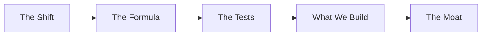

*"Here's the logic we'll walk through — each step forces the next."*

---

## 1 · The Shift

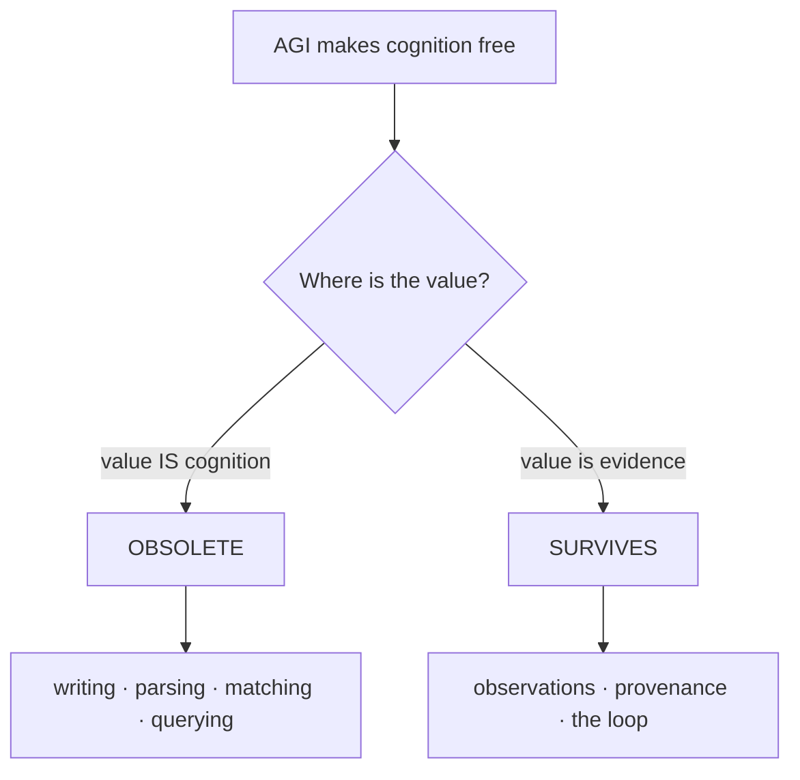

*"When thinking gets free, only one kind of thing keeps its value."*

---

## 2 · The Formula

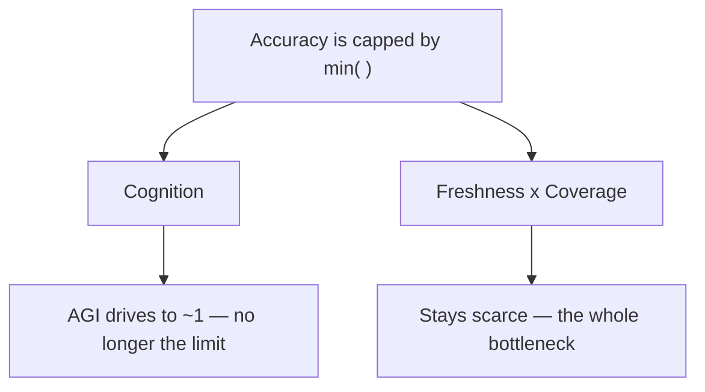

*"Accuracy is a min of two things. AGI removes one. So the other is everything."*

---

## 3 · The Three Tests

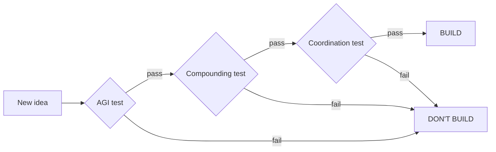

*"Every idea runs three gates in series. Miss one, it dies."*

---

## 4 · The Litmus Test

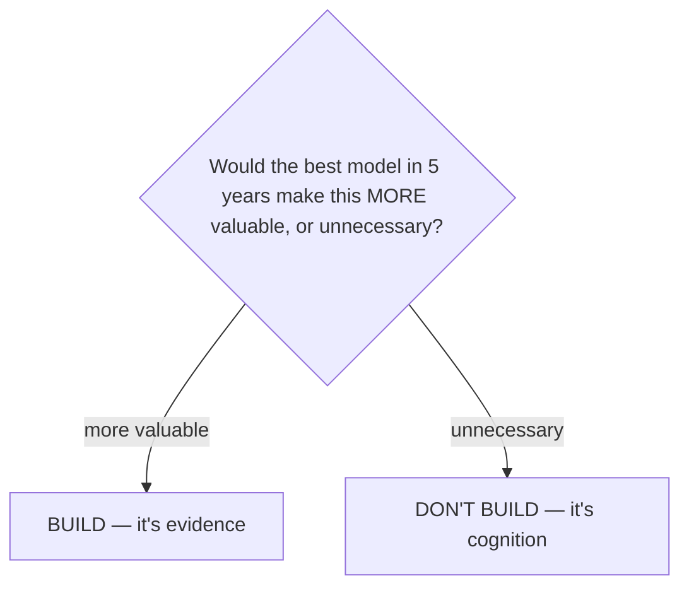

*"When in doubt, one question decides it."*

---

## 5 · The Problem

The problem is not a number — it's **trust**. Unreliable data can't be trusted, and without trust the entire promise of AI-native GTM collapses.

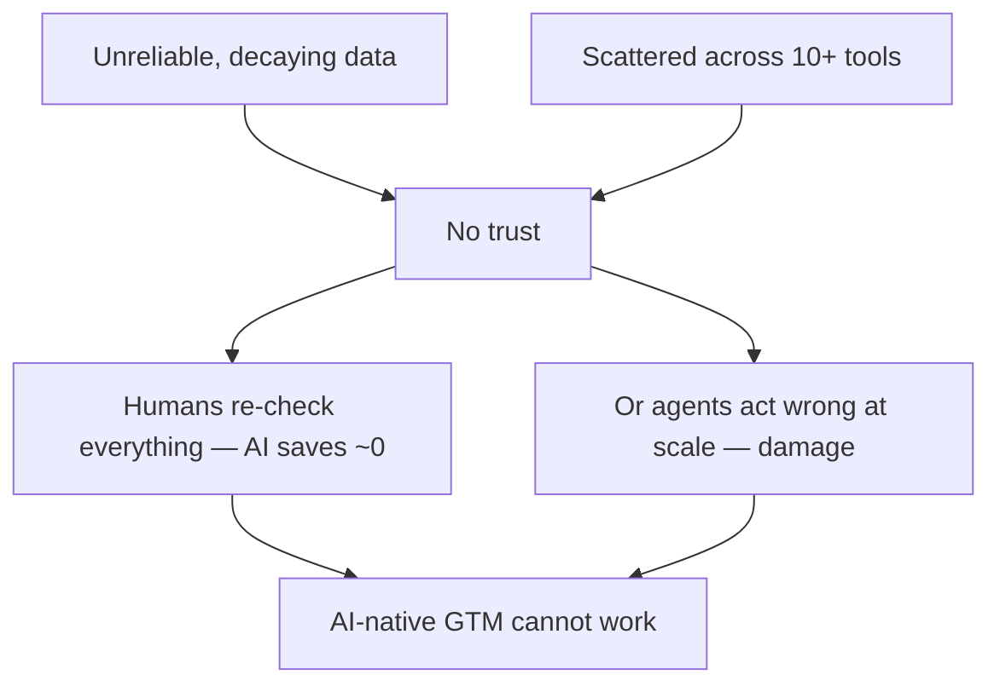

*"Bad data isn't the problem. Untrustworthy data is — because an agent either gets babysat, or does damage at scale. Trust is the hinge everything turns on."*

---

## 6 · The Baseline

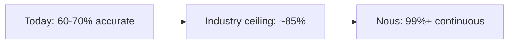

*"Everyone is stuck below 85%. We're going somewhere no current tooling reaches — and we keep it there."*

---

## 7 · What We Build — the substrate

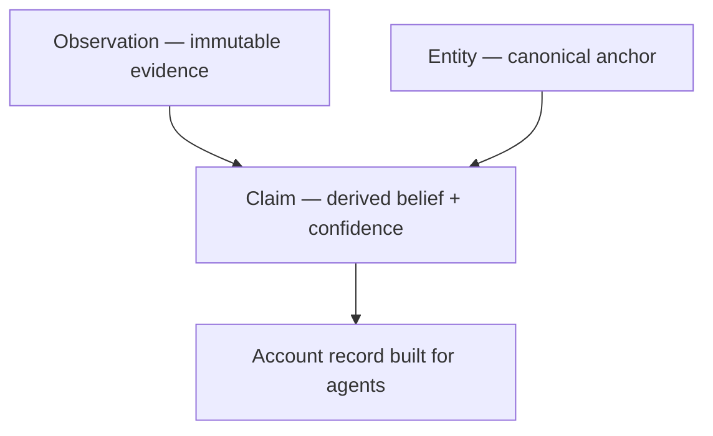

*"Three primitives. We store evidence and derive belief — we never store a bare value."*

---

## 8 · The Self-Healing Loop

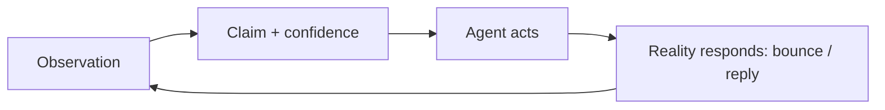

*"Reality answers back, and every answer corrects the model. For free."*

---

## 9 · The Compound Loop

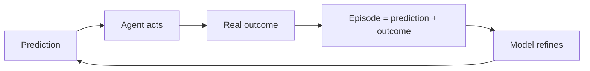

*"Every prediction gets graded. Every grade makes the next one sharper."*

---

## 10 · Why Us — vs the alternatives

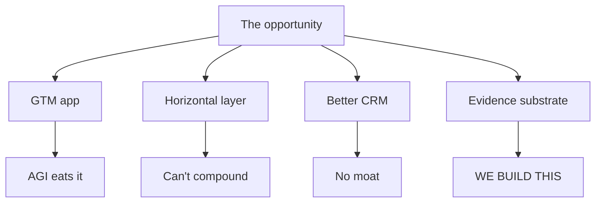

*"Four paths. Three are traps. One appreciates."*

---

## 11 · The ROI

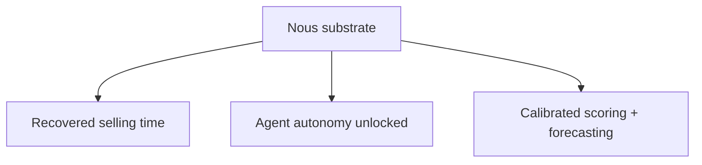

*"Reliable data turns into money three ways — and autonomy is the big one."*

---

## 12 · The Moat

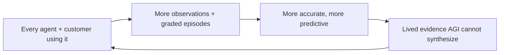

*"The moat isn't the code. It's the lived record — and it compounds with every use."*
